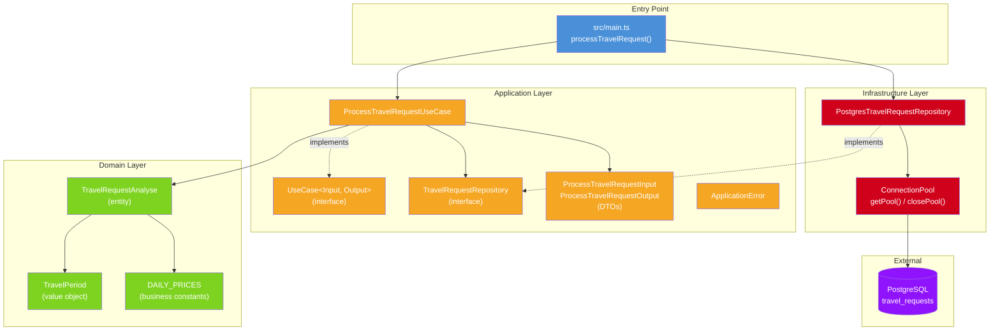

# Dependency Diagram — Travel Request Processing

## Architecture Overview

## Dependency Direction

- **main.ts** → Application (UseCase) + Infrastructure (Repository instance)
- **Application** → Domain (entities, value objects)
- **Application** defines interfaces (contracts)
- **Infrastructure** implements Application interfaces
- **Domain** has NO external dependencies
- Dependencies point **inward** (Dependency Inversion Principle)
